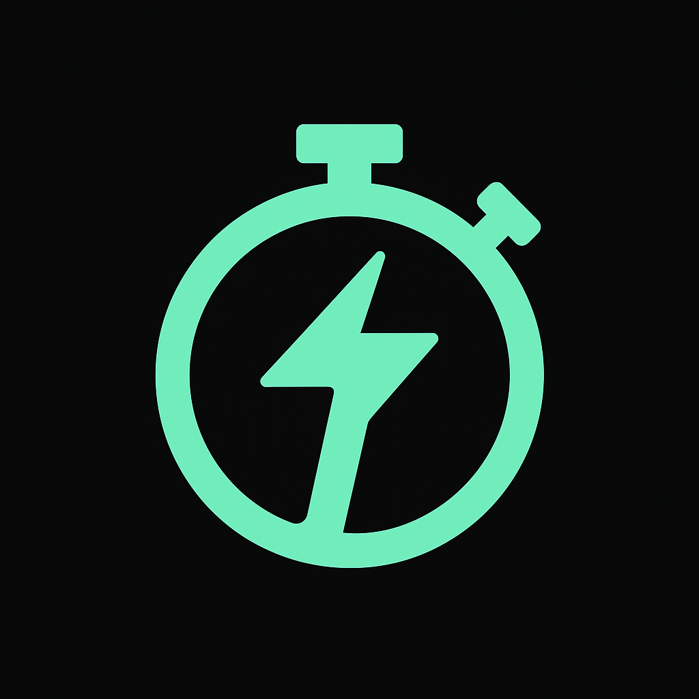

# ThinkFast 🧠⚡

A lightning-fast trivia quiz app built with React Native and Expo, designed to test your knowledge across various categories with beautiful UI and engaging features.



## 🚀 Features

### 🎯 Core Functionality

- **Multiple Quiz Categories**: 10 different categories including Science, History, Movies, Music, Sports, and more
- **Intelligent Search**: Smart search through categories and subcategories
- **Timed Challenges**: Customizable time limits for each question
- **Difficulty Levels**: Easy, Medium, and Hard difficulty options
- **Lifelines System**: 50/50, Skip Question, and Extra Time lifelines
- **Daily Challenge**: Fresh daily quizzes with unique questions
- **Random Quiz**: Surprise yourself with random category selection

### 📱 User Experience

- **Modern Material Design**: Clean, intuitive interface using React Native Paper
- **Real Category Images**: Beautiful Unsplash images for each category
- **Haptic Feedback**: Tactile responses for better interaction
- **Animations**: Smooth transitions and micro-interactions
- **Dark/Light Theme**: Automatic theme switching based on system preference
- **Responsive Design**: Works perfectly on phones and tablets

### 📊 Progress & Analytics

- **Score Tracking**: Detailed scoring system with percentages
- **Leaderboard**: Compare your performance with historical data
- **Time Tracking**: Monitor your response times
- **Result Analysis**: View correct/incorrect answers after each quiz
- **Progress History**: Track your improvement over time

### 🎮 Interactive Features

- **Pause/Resume**: Pause quizzes anytime and resume later
- **Question Navigation**: Review questions and answers
- **Smart Suggestions**: Popular topic suggestions for quick access
- **Category Browsing**: Explore all available categories with topic previews

## 🛠️ Technical Stack

### Frontend

- **React Native**: Cross-platform mobile development
- **Expo**: Development platform and toolchain
- **TypeScript**: Type-safe JavaScript development
- **React Native Paper**: Material Design components
- **Expo Router**: File-based navigation system

### Backend & APIs

- **The Trivia API**: Comprehensive trivia question database
- **Axios**: HTTP client for API requests
- **AsyncStorage**: Local data persistence

### UI/UX Libraries

- **Expo Vector Icons**: Comprehensive icon library
- **React Native Reanimated**: Smooth animations
- **Expo Haptics**: Tactile feedback
- **React Native Confetti**: Celebration animations
- **Lottie React Native**: Vector animations

## 📁 Project Structure

```
ThinkFast/
├── app/                          # Main application screens
│   ├── index.tsx                # Home screen with search
│   ├── categories.tsx           # Category selection
│   ├── quiz-config.tsx          # Quiz configuration
│   ├── quiz.tsx                 # Main quiz interface
│   ├── results.tsx              # Quiz results
│   ├── leaderboard.tsx          # Score history
│   ├── settings.tsx             # App settings
│   └── welcome.tsx              # Onboarding screen
├── components/                   # Reusable components
│   ├── AnswerButton.tsx         # Quiz answer buttons
│   ├── Lifelines.tsx            # Lifeline components
│   ├── LoadingSpinner.tsx       # Loading indicators
│   ├── TimerBar.tsx             # Quiz timer
│   └── ui/                      # UI components
├── constants/                    # App constants
│   ├── Colors.ts                # Color palette
│   └── CategoryIcons.ts         # Category icons & images
├── hooks/                        # Custom React hooks
│   ├── useColorScheme.ts        # Theme detection
│   └── useThemeColor.ts         # Theme color utilities
├── services/                     # API and data services
│   ├── triviaAPI.ts             # Trivia API integration
│   └── storage.ts               # Local storage service
├── types/                        # TypeScript definitions
│   └── index.ts                 # Type definitions
├── utils/                        # Utility functions
│   └── helpers.ts               # Helper functions
└── assets/                       # Static assets
    ├── images/                  # App icons and images
    └── fonts/                   # Custom fonts
```

## 🎯 Key Components

### 1. Quiz Engine (`app/quiz.tsx`)

The core quiz component that handles:

- Question display and answer selection
- Timer management with pause/resume
- Lifeline system implementation
- Score calculation and tracking
- Answer shuffling (fixed to prevent re-shuffling)

### 2. Category System (`app/categories.tsx`)

Beautiful category browser featuring:

- Real images from Unsplash for each category
- Topic chips showing subcategories
- Smart search through categories and topics
- Single-column layout for better content visibility

### 3. Search Functionality (`app/index.tsx`)

Intelligent search system that:

- Searches through 10 main categories
- Matches subcategories (e.g., "movies" → "Film & TV")
- Provides helpful suggestions
- Falls back to category browsing when no matches found

### 4. Trivia API Service (`services/triviaAPI.ts`)

Robust API integration that:

- Fetches questions from The Trivia API
- Handles category-based search
- Manages error states and fallbacks
- Provides random question selection

### 5. Storage Service (`services/storage.ts`)

Local data management for:

- User preferences and settings
- Quiz history and scores
- Daily challenge tracking
- First-time user onboarding

## 🎨 Design System

### Color Palette

```typescript
BrandColors = {
  primary: "#667eea", // Main brand color
  accent: "#764ba2", // Accent color
  background: "#f8f9fa", // Background
  card: "#ffffff", // Card backgrounds
  text: "#1a202c", // Primary text
  textSecondary: "#718096", // Secondary text
  border: "#e2e8f0", // Borders
  success: "#48bb78", // Success states
  error: "#f56565", // Error states
  warning: "#ed8936", // Warning states
};
```

### Typography

- **Headers**: Bold, 48px for title, 20px for section headers
- **Body**: Regular, 16px for main content
- **Captions**: 12px for metadata and labels
- **Buttons**: Semi-bold, 18px for primary actions

## 🔧 Installation & Setup

### Prerequisites

- Node.js (v16 or higher)
- Expo CLI
- iOS Simulator (for iOS development)
- Android Studio (for Android development)

### Installation Steps

1. **Clone the repository**

```bash
git clone https://github.com/yourusername/thinkfast.git
cd thinkfast
```

2. **Install dependencies**

```bash
npm install
```

3. **Start the development server**

```bash
npm start
```

4. **Run on specific platforms**

```bash
# iOS
npm run ios

# Android
npm run android

# Web
npm run web
```

## 🏗️ Build & Deployment

### Development Build

```bash
npx expo build:android
npx expo build:ios
```

### Production Build

```bash
npx expo build:android --release-channel production
npx expo build:ios --release-channel production
```

## 🧪 Testing

### Running Tests

```bash
npm test
```

### Linting

```bash
npm run lint
```

## 📱 Supported Platforms

- **iOS**: iOS 13.0+
- **Android**: Android 6.0+ (API level 23+)
- **Web**: Modern browsers with ES6 support

## 🎯 Quiz Categories

The app supports 10 main categories with various subcategories:

1. **Arts & Literature** - arts, literature, novels
2. **Film & TV** - movies, film, television
3. **Food & Drink** - food, beverages, alcohol
4. **General Knowledge** - mixed topics
5. **Geography** - world geography, capitals
6. **History** - historical events, figures
7. **Music** - artists, songs, instruments
8. **Science** - biology, chemistry, physics
9. **Society & Culture** - social topics, culture
10. **Sport & Leisure** - sports, games, recreation

## 🎮 Game Features

### Lifelines

- **50/50**: Remove 2 incorrect answers
- **Skip**: Skip the current question
- **Extra Time**: Add 15 seconds to timer

### Scoring System

- Correct answers: Variable points based on difficulty
- Time bonus: Faster answers get bonus points
- Percentage calculation: (Correct answers / Total questions) × 100

### Difficulty Levels

- **Easy**: Basic questions, longer time limits
- **Medium**: Moderate difficulty, standard time
- **Hard**: Challenging questions, shorter time limits

## 🔮 Future Enhancements

- [ ] Multiplayer mode
- [ ] Achievement system
- [ ] Custom quiz creation
- [ ] Offline mode
- [ ] Social sharing
- [ ] Voice questions
- [ ] AR/VR integration
- [ ] Machine learning for personalized difficulty

## 🤝 Contributing

1. Fork the repository
2. Create your feature branch (`git checkout -b feature/amazing-feature`)
3. Commit your changes (`git commit -m 'Add some amazing feature'`)
4. Push to the branch (`git push origin feature/amazing-feature`)
5. Open a Pull Request

## 📄 License

This project is licensed under the MIT License - see the [LICENSE](LICENSE) file for details.

## 🙏 Acknowledgments

- **The Trivia API** for providing comprehensive trivia questions
- **Unsplash** for beautiful category images
- **React Native Paper** for Material Design components
- **Expo** for the amazing development platform

## 📞 Support

For support, email support@thinkfast.app or join our Discord community.

---

**ThinkFast** - Where knowledge meets speed! ⚡🧠
